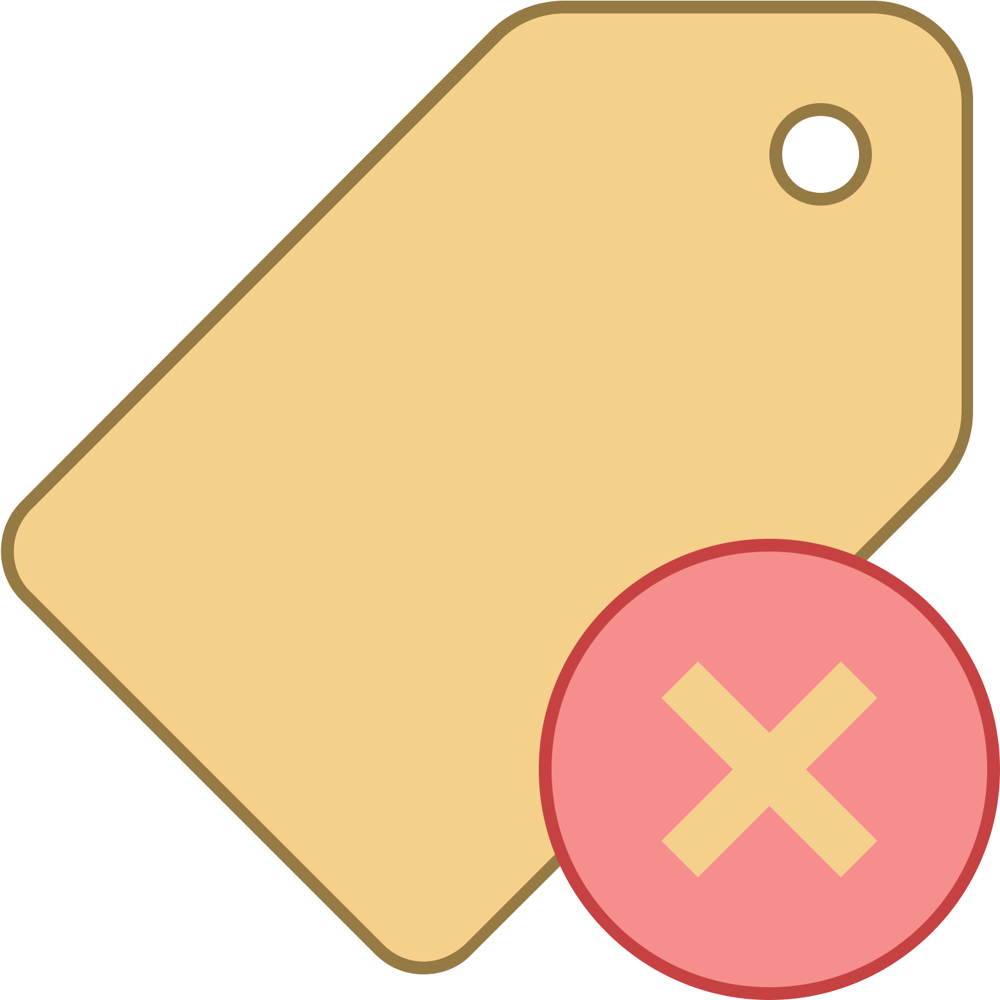

# Shipwreck Form - Complete Tutorial

The Shipwreck Form is the primary interface for documenting shipwreck sites in the HFF Survey system. This tutorial provides comprehensive guidance on all features, fields, and workflows.

---

## Table of Contents

1. [Opening the Form](#opening-the-form)
2. [Toolbar Reference](#toolbar-reference)
3. [Form Fields - Complete Reference](#form-fields---complete-reference)
4. [Coordinate System and GIS Integration](#coordinate-system-and-gis-integration)
5. [Working with Records](#working-with-records)
6. [Search and Filtering](#search-and-filtering)
7. [Exporting Data](#exporting-data)
8. [Media Management](#media-management)
9. [Common Errors and Solutions](#common-errors-and-solutions)
10. [Best Practices](#best-practices)

---

## Opening the Form

### Method 1: Toolbar
Click the **Shipwreck** icon  in the HFF toolbar.

### Method 2: Menu
Navigate to **HFF Menu > Shipwreck Form**

### Method 3: Keyboard Shortcut
Press `Ctrl+Shift+W` (if configured)

---

## Toolbar Reference

### Navigation Buttons

| Button | Name | Description | Keyboard |
|--------|------|-------------|----------|
|  | **First Record** | Go to the first record in the database | `Ctrl+Home` |
|  | **Previous Record** | Go to the previous record | `Ctrl+Left` |
|  | **Next Record** | Go to the next record | `Ctrl+Right` |
|  | **Last Record** | Go to the last record in the database | `Ctrl+End` |

**Record Counter:** Shows current position (e.g., "Record 5 of 23")

### Data Management Buttons

| Button | Name | Description | Notes |
|--------|------|-------------|-------|
|  | **New Record** | Create a new empty record | Clears all fields |
|  | **Save Record** | Save current record | Also syncs coordinates to GIS |
|  | **Delete Record** | Delete current record | **Cannot be undone!** |

### Search & Filter Buttons

| Button | Name | Description |
|--------|------|-------------|
|  | **New Search** | Enter search mode - fields become filters |
|  | **Execute Search** | Run search with entered criteria |
|  | **View All** | Clear filters, show all records |
|  | **Sort** | Open sort panel for ordering |
|  | **Quantification** | Statistical analysis of records |

### Export Buttons

| Button | Name | Output Format |
|--------|------|---------------|
|  | **Export PDF** | PDF report with all details |
|  | **Export Excel** | XLSX spreadsheet |
|  | **List View** | Table view of all records |

### GIS Integration Buttons

| Button | Name | Description |
|--------|------|-------------|
|  | **Load Layer** | Load shipwreck point layer on map |
|  | **GIS Tools** | Open GIS operations panel |
|  | **Open Folder** | Open data directory |

### Media Buttons

| Button | Name | Description |
|--------|------|-------------|
|  | **Show Images** | Display all linked images |
|  | **Add Tag** | Tag selected images |
|  | **Remove Tag** | Remove tags from images |

---

## Form Fields - Complete Reference

### Tab 1: Identification

#### Code (Required Field)

| Property | Value |
|----------|-------|
| **Field Name** | `code_id` |
| **Type** | Text (String) |
| **Required** | Yes |
| **Unique** | Yes |
| **Max Length** | 50 characters |

**Description:** Unique identifier code for the shipwreck site.

**Format Examples:**
| Format | Example | Description |
|--------|---------|-------------|
| Sequential | `SW-001`, `SW-002` | Simple numbered sequence |
| Site-based | `TYR-SW-001` | Site code + shipwreck number |
| Year-based | `2024-SW-001` | Year + sequence number |
| Geographic | `MED-LEB-SW-001` | Region + country + number |

**Validation Rules:**
- Cannot be empty
- Must be unique in the database
- No special characters except hyphen (-) and underscore (_)

**Common Errors:**
| Error | Cause | Solution |
|-------|-------|----------|
| "Code already exists" | Duplicate code | Use a different, unique code |
| "Code is required" | Empty field | Enter a valid code |
| "Invalid characters" | Special chars used | Use only letters, numbers, - and _ |

---

#### Name of Vessel

| Property | Value |
|----------|-------|
| **Field Name** | `name_vessel` |
| **Type** | Text (String) |
| **Required** | No |
| **Max Length** | 100 characters |

**Description:** Historical name of the vessel, if known.

**Examples:**
- `SS Thistlegorm`
- `HMS Victoria`
- `Unknown Phoenician Merchant`
- `Merchant Vessel A`

**Notes:**
- Use "Unknown" prefix for unidentified vessels
- Include vessel type if name unknown
- Can include alternative names in parentheses

---

#### Nickname

| Property | Value |
|----------|-------|
| **Field Name** | `nickname` |
| **Type** | Text (String) |
| **Required** | No |

**Description:** Local or diver-given name for the wreck.

**Examples:**
- `The Sugar Wreck`
- `Abu Galawa`
- `The Tile Wreck`

---

#### Site

| Property | Value |
|----------|-------|
| **Field Name** | `name` |
| **Type** | Dropdown (from Site table) |
| **Required** | Recommended |

**Description:** Associated archaeological site name.

**Note:** Select from existing sites or create new site first via Site Form.

---

#### Area

| Property | Value |
|----------|-------|
| **Field Name** | `area` |
| **Type** | Dropdown |
| **Required** | Recommended |

**Description:** Specific area within the site.

**Examples:**
- `Sector A`, `Sector B`
- `North Basin`, `South Harbor`
- `Grid Square 15-20`

---

#### Nationality

| Property | Value |
|----------|-------|
| **Field Name** | `nationality` |
| **Type** | Dropdown |
| **Required** | Recommended |

**Description:** Flag state or country of origin of the vessel.

**Standard Values:**
- `Greek`, `Roman`, `Phoenician`, `Egyptian`
- `British`, `French`, `German`, `Italian`
- `Ottoman`, `Byzantine`, `Unknown`

---

### Tab 2: Classification

#### Category

| Property | Value |
|----------|-------|
| **Field Name** | `category` |
| **Type** | Dropdown |
| **Values** | Ancient, Historical, Modern, Unknown |

**Description:** Temporal category of the wreck.

| Value | Time Period | Example |
|-------|-------------|---------|
| Ancient | Before 500 CE | Greek trireme |
| Historical | 500-1900 CE | Ottoman trader |
| Modern | After 1900 CE | WWII vessel |
| Unknown | Undetermined | Unidentified wreck |

---

#### Type

| Property | Value |
|----------|-------|
| **Field Name** | `type` |
| **Type** | Dropdown |

**Description:** Vessel type classification.

**Standard Values:**
| Type | Description |
|------|-------------|
| Merchant Ship | Commercial cargo vessel |
| Warship | Military vessel |
| Fishing Boat | Fishing vessel |
| Passenger Ship | Passenger transport |
| Tanker | Liquid cargo vessel |
| Ferry | Short-route passenger |
| Submarine | Underwater military vessel |
| Sailing Vessel | Wind-powered vessel |
| Unknown | Type not determined |

---

#### Propulsion

| Property | Value |
|----------|-------|
| **Field Name** | `propulsion` |
| **Type** | Dropdown |

**Description:** Primary propulsion method.

| Value | Description |
|-------|-------------|
| Sail | Wind-powered (ancient to modern) |
| Steam | Steam engine |
| Motor | Internal combustion |
| Oar | Human-powered rowing |
| Sail and Oar | Combined propulsion |
| Nuclear | Nuclear-powered |
| Unknown | Propulsion not determined |

---

#### Material

| Property | Value |
|----------|-------|
| **Field Name** | `material` |
| **Type** | Dropdown |

**Description:** Primary construction material of the hull.

| Value | Period | Notes |
|-------|--------|-------|
| Wood | All periods | Most common for ancient/historical |
| Iron | 1800s onwards | Early metal hulls |
| Steel | 1880s onwards | Modern standard |
| Composite | 1850-1900 | Wood planking on iron frame |
| Concrete | 1900s | Experimental vessels |
| Fiberglass | 1950s onwards | Modern recreational |
| Unknown | Any | Material not determined |

---

### Tab 3: Location

#### Latitude

| Property | Value |
|----------|-------|
| **Field Name** | `latitude` |
| **Type** | Number (Float) |
| **Range** | -90.0 to +90.0 |
| **Precision** | 6 decimal places recommended |

**Description:** North-South position in decimal degrees (WGS84).

**Supported Input Formats:**

| Format | Example | Description |
|--------|---------|-------------|
| Decimal Degrees | `34.123456` | Recommended format |
| Degrees Minutes | `34°7.407'N` | DM format |
| Degrees Minutes Seconds | `34°7'24.4"N` | DMS format |

**Conversion Examples:**
```
DMS to Decimal:
34° 7' 24.4" N = 34 + (7/60) + (24.4/3600) = 34.123444

DM to Decimal:
34° 7.407' N = 34 + (7.407/60) = 34.12345
```

**Validation:**
- Must be between -90 and +90
- Positive = North, Negative = South
- Mediterranean Sea range: approximately 30° to 46°

---

#### Longitude

| Property | Value |
|----------|-------|
| **Field Name** | `longitude` |
| **Type** | Number (Float) |
| **Range** | -180.0 to +180.0 |
| **Precision** | 6 decimal places recommended |

**Description:** East-West position in decimal degrees (WGS84).

**Supported Input Formats:**

| Format | Example | Description |
|--------|---------|-------------|
| Decimal Degrees | `35.654321` | Recommended format |
| Degrees Minutes | `35°39.259'E` | DM format |
| Degrees Minutes Seconds | `35°39'15.5"E` | DMS format |

**Validation:**
- Must be between -180 and +180
- Positive = East, Negative = West
- Eastern Mediterranean range: approximately 10° to 40°

---

#### Position Quality

| Property | Value |
|----------|-------|
| **Field Name** | `position_quality_1` |
| **Type** | Dropdown |

**Description:** Accuracy/reliability of the position data.

| Value | Description | Typical Error |
|-------|-------------|---------------|
| GPS Differential | High-precision GPS | < 1 meter |
| GPS Standard | Standard GPS | 1-5 meters |
| Estimated | Calculated from references | 10-50 meters |
| Approximate | General location | 50-500 meters |
| Unknown | Accuracy not recorded | Unknown |

---

#### Depth (Min/Max)

| Property | Value |
|----------|-------|
| **Field Name** | `depth_max_min` |
| **Type** | Text |
| **Format** | "min-max" or single value |

**Description:** Depth range of the wreck in meters.

**Examples:**
| Input | Description |
|-------|-------------|
| `25` | Single depth (flat wreck) |
| `18-32` | Depth range |
| `15-45` | Large depth variation |

**Notes:**
- Use meters, not feet
- Measure from surface at mean sea level
- Include both shallowest and deepest points

---

#### Depth Quality

| Property | Value |
|----------|-------|
| **Field Name** | `depth_quality` |
| **Type** | Dropdown |

| Value | Description |
|-------|-------------|
| Measured | Measured with depth gauge |
| Dive Computer | Recorded by dive computer |
| Sonar | Measured by echo sounder |
| Estimated | Estimated from references |
| Unknown | Accuracy unknown |

---

### Tab 4: Physical Characteristics

#### Dimensions

| Field | Database Field | Unit | Description |
|-------|---------------|------|-------------|
| Length (L) | `l` | meters | Overall length |
| Width (W) | `w` | meters | Maximum beam |
| Depth/Height (D) | `d` | meters | Height above seabed |
| Draft (T) | `t` | meters | Original draft |

**Cargo Hold Dimensions:**

| Field | Database Field | Unit | Description |
|-------|---------------|------|-------------|
| Cargo Length (CL) | `cl` | meters | Cargo hold length |
| Cargo Width (CW) | `cw` | meters | Cargo hold width |
| Cargo Depth (CD) | `cd` | meters | Cargo hold depth |

**Example Entry:**
```
Merchant vessel:
  Length: 35.5 m
  Width: 8.2 m
  Height above seabed: 4.5 m
  Cargo hold: 20 x 6 x 3 m
```

---

#### Wreck Condition

| Property | Value |
|----------|-------|
| **Field Name** | `wreck` |
| **Type** | Dropdown |

| Value | Description |
|-------|-------------|
| Intact | Complete hull, recognizable |
| Broken | Hull broken but identifiable |
| Scattered | Debris field |
| Buried | Partially or fully buried |
| Collapsed | Structure collapsed |

---

#### Composition (Seabed)

| Property | Value |
|----------|-------|
| **Field Name** | `composition` |
| **Type** | Dropdown |

| Value | Description |
|-------|-------------|
| Sand | Sandy bottom |
| Mud | Muddy/silty bottom |
| Rock | Rocky bottom |
| Coral | Coral reef |
| Posidonia | Seagrass meadow |
| Mixed | Combination |

---

#### Inclination

| Property | Value |
|----------|-------|
| **Field Name** | `inclination` |
| **Type** | Dropdown |

| Value | Description |
|-------|-------------|
| Upright | Sitting level |
| Port List | Tilted to port |
| Starboard List | Tilted to starboard |
| Capsized | Upside down |
| On Side | Lying on side |

---

### Tab 5: History

#### Date Built

| Property | Value |
|----------|-------|
| **Field Name** | `date_built` |
| **Type** | Text |

**Format Examples:**
| Input | Description |
|-------|-------------|
| `1920` | Exact year |
| `1915-1920` | Range |
| `ca. 1900` | Approximate |
| `2nd c. BCE` | Century |
| `Unknown` | Not determined |

---

#### Date Lost

| Property | Value |
|----------|-------|
| **Field Name** | `date_lost` |
| **Type** | Text |

**Format Examples:**
| Input | Description |
|-------|-------------|
| `1941-11-15` | Exact date |
| `1941` | Year only |
| `WWII` | Period |
| `ca. 200 BCE` | Approximate ancient |

---

#### Cause of Loss

| Property | Value |
|----------|-------|
| **Field Name** | `cause` |
| **Type** | Dropdown |

| Value | Description |
|-------|-------------|
| Storm | Weather-related sinking |
| Collision | Hit another vessel/object |
| Fire | Burned |
| War Action | Military action |
| Torpedo | Torpedoed |
| Mine | Hit a mine |
| Grounding | Ran aground |
| Structural Failure | Hull failure |
| Scuttled | Intentionally sunk |
| Unknown | Cause not determined |

---

#### Builder / Yard

| Property | Value |
|----------|-------|
| **Field Name** | `builder` / `yard` |
| **Type** | Text |

**Examples:**
- `Harland & Wolff, Belfast`
- `Unknown Phoenician yard`
- `Cantieri Navali Riuniti, Genoa`

---

#### Owner

| Property | Value |
|----------|-------|
| **Field Name** | `owner` |
| **Type** | Text |

**Description:** Owner at time of loss.

**Examples:**
- `White Star Line`
- `Royal Navy`
- `Unknown merchant`

---

### Tab 6: Documentation

#### Description

| Property | Value |
|----------|-------|
| **Field Name** | `description` |
| **Type** | Multi-line text |
| **Max Length** | Unlimited |

**Description:** Detailed description of the wreck site.

**What to Include:**
1. Overall appearance and orientation
2. Visible structural features
3. Cargo remains
4. Notable artifacts observed
5. Marine life and growth
6. Diving conditions

**Example:**
```
The wreck lies upright on a sandy bottom at 32m depth, oriented
NW-SE. The bow section is largely intact with the anchor chain
still visible. The midship section has collapsed but the cargo
of amphorae is clearly visible, scattered across a 20m area.
The stern is buried in sand. Significant marine growth covers
most surfaces, with groupers inhabiting the hold area.
```

---

#### History

| Property | Value |
|----------|-------|
| **Field Name** | `history` |
| **Type** | Multi-line text |

**Description:** Historical information about the vessel.

**What to Include:**
1. Construction history
2. Service history
3. Circumstances of loss
4. Discovery history
5. Previous investigations

---

#### Status

| Property | Value |
|----------|-------|
| **Field Name** | `status` |
| **Type** | Dropdown |

| Value | Description |
|-------|-------------|
| Discovered | Recently found |
| Under Investigation | Active research |
| Documented | Fully recorded |
| Protected | Legal protection |
| At Risk | Threatened site |
| Destroyed | No longer exists |

---

### Tab 7: References

#### Bibliography Table

| Column | Description |
|--------|-------------|
| Author | Author name(s) |
| Year | Publication year |
| Title | Publication title |
| Reference | Full citation |

**Adding References:**
1. Click "Add" button
2. Fill in the citation fields
3. Click "Save"

---

#### Storage Location

| Property | Value |
|----------|-------|
| **Field Name** | `storage_` |
| **Type** | Text |

**Description:** Location of artifacts/documentation.

**Examples:**
- `National Museum, Room 12, Shelf B`
- `University Archive, Box 45`
- `Field storage, Site TYR`

---

## Coordinate System and GIS Integration

### Bidirectional Coordinate Synchronization

The Shipwreck form features **automatic bidirectional sync** between form fields and the GIS layer.

#### Form → GIS (Saving)

When you save a record with coordinates:

1. The system detects the database geometry column SRID
2. Coordinates are transformed from WGS84 (4326) to the target SRID if needed
3. A point is created/updated in the `shipwreck_location` table
4. The map layer refreshes automatically

**Supported Transformations:**
| Input (Form) | Database SRID | Action |
|--------------|---------------|--------|
| WGS84 (4326) | 4326 | Direct insert |
| WGS84 (4326) | 32636 (UTM 36N) | Transform via ST_Transform |
| WGS84 (4326) | Any SRID | Auto-transform |

#### GIS → Form (Selection)

When you select a feature on the map:

1. The point coordinates are read from the layer
2. Coordinates are transformed to WGS84 if the layer uses different CRS
3. The form fields are updated with decimal degrees
4. The corresponding record is loaded if found

---

### Loading the Shipwreck Layer

#### Step-by-Step:

1. Open the Shipwreck Form
2. Click the **Load Layer** button 
3. The `shipwreck_view` layer loads in QGIS
4. The layer appears under "View Shipwreck" group

#### Layer Structure:

```
View Shipwreck (Group)
└── Shipwreck view (Point Layer)
    ├── code
    ├── name_vessel
    ├── nationality
    └── the_geom (Point)
```

---

### Adding Points Manually on Map

1. Load the shipwreck layer
2. Select the layer in QGIS Layers panel
3. Click **Toggle Editing** (pencil icon)
4. Select **Add Point Feature** tool
5. Click on the map at the wreck location
6. Fill in attributes (code, nationality, name)
7. Click **Save Edits**
8. Coordinates appear in form when feature is selected

---

## Working with Records

### Creating a New Record

1. Click **New Record** 
2. All fields are cleared
3. Enter the **Code** (required)
4. Fill in other fields
5. Enter coordinates (latitude/longitude)
6. Click **Save** 

### Editing an Existing Record

1. Navigate to the record
2. Modify fields as needed
3. Click **Save** 

### Deleting a Record

1. Navigate to the record
2. Click **Delete** 
3. Confirm deletion

**Warning:** Deletion cannot be undone!

---

## Search and Filtering

### Basic Search

1. Click **New Search** 
2. Enter search criteria in any field
3. Click **Search** 

### Search Examples

| To Find | Enter In Field |
|---------|----------------|
| All Greek ships | Nationality: `Greek` |
| Wrecks deeper than 30m | Depth: `30-` |
| WWII wrecks | Date Lost: `1939-1945` |
| Wrecks in Area A | Area: `A` |

### Using Wildcards

| Pattern | Meaning | Example |
|---------|---------|---------|
| `%` | Any characters | `SW-%` matches SW-001, SW-002 |
| `_` | Single character | `SW-00_` matches SW-001 to SW-009 |

### Clearing Search

Click **View All**  to clear filters.

---

## Exporting Data

### PDF Export

1. Navigate to record (or search results)
2. Click **PDF** 
3. Choose export options:
   - Current record only
   - All search results
   - Include images
4. Select save location
5. PDF is generated

### Excel Export

1. Click **Excel** 
2. Choose fields to export
3. Select save location
4. XLSX file is created

---

## Media Management

### Linking Images

1. Click **Show Images** 
2. Click **Upload Photos**
3. Select image files
4. Images are linked to current record

### Image Requirements

| Property | Recommended |
|----------|-------------|
| Format | JPEG, PNG, TIFF |
| Resolution | 300 DPI minimum |
| Size | 2-10 MB |
| Naming | `SW-001_view1.jpg` |

### Tagging Images

1. Select images in thumbnail view
2. Click **Add Tag** 
3. Choose or create tags
4. Tags help organize and search images

**Suggested Tags:**
- `overview`, `detail`, `artifact`
- `bow`, `stern`, `midship`
- `before_conservation`, `after_conservation`

---

## Common Errors and Solutions

### Error: "Code already exists"

| Cause | Solution |
|-------|----------|
| Duplicate code entered | Use a unique code |
| Record already exists | Search for existing record |

### Error: "Failed to save geometry"

| Cause | Solution |
|-------|----------|
| Invalid coordinates | Check lat/lon values are valid |
| SRID mismatch | System handles automatically |
| Database connection lost | Reconnect to database |

### Error: "Invalid Layer"

| Cause | Solution |
|-------|----------|
| Table doesn't exist | Check database structure |
| No geometry column | Verify `the_geom` column exists |
| Wrong database | Check connection settings |

### Error: "Connection refused"

| Cause | Solution |
|-------|----------|
| Database not running | Start PostgreSQL/SQLite |
| Wrong credentials | Check username/password |
| Wrong port | Verify port number (default: 5432) |

### Points Not Appearing on Map

| Check | Solution |
|-------|----------|
| Layer loaded? | Click Load Layer button |
| Layer visible? | Check layer visibility checkbox |
| Correct extent? | Right-click > Zoom to Layer |
| CRS mismatch? | Set project CRS to EPSG:4326 |

### Coordinates Show as 0,0

| Cause | Solution |
|-------|----------|
| No coordinates entered | Enter latitude and longitude |
| Invalid format | Use decimal degrees |
| Record not saved | Click Save button |

---

## Best Practices

### Data Entry

1. **Always use unique codes** - Follow consistent naming convention
2. **Enter coordinates first** - Verify location on map before other data
3. **Save frequently** - Don't lose work
4. **Use dropdowns** - Select from lists rather than typing
5. **Complete all tabs** - Comprehensive records are more useful

### Documentation

1. **Write detailed descriptions** - Future researchers depend on this
2. **Include measurements** - All available dimensions
3. **Note uncertainties** - Use "Unknown" or "ca." when appropriate
4. **Add references** - Link to publications and reports
5. **Upload photos** - Visual documentation is essential

### GIS Integration

1. **Verify coordinates on map** - Check position after saving
2. **Use correct format** - Decimal degrees preferred
3. **Check depth values** - Ensure reasonable range
4. **Load layer before editing** - See existing points

### Quality Control

1. **Review before saving** - Check all fields
2. **Verify coordinates** - Compare with other sources
3. **Cross-check data** - Verify against dive logs
4. **Regular backups** - Export data periodically

---

## Keyboard Shortcuts

| Shortcut | Action |
|----------|--------|
| `Ctrl+N` | New Record |
| `Ctrl+S` | Save Record |
| `Ctrl+F` | New Search |
| `Ctrl+Home` | First Record |
| `Ctrl+End` | Last Record |
| `Ctrl+Left` | Previous Record |
| `Ctrl+Right` | Next Record |

---

## Related Tutorials

- [Site Form Tutorial](03_site_form.md) - Managing site records
- [Divelog Form Tutorial](04_divelog_form.md) - Recording dives
- [Anchor Form Tutorial](05_anchor_form.md) - Documenting anchors
- [Media Management Tutorial](09_media_management.md) - Working with images
- [PDF Export Tutorial](10_pdf_export.md) - Creating reports

---

*Previous: [Anchor Form Tutorial](05_anchor_form.md)*
*Next: [Pottery Form Tutorial](07_pottery_form.md)*
