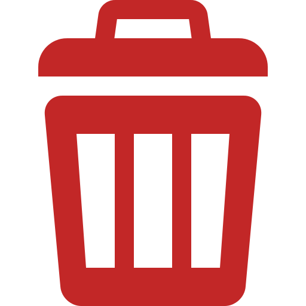

# Artefact Conservation Form - Complete Tutorial

The Artefact Conservation Form documents conservation treatments and analysis of non-ceramic archaeological finds in the HFF Survey system.

## Opening the Artefact Conservation Form

1. Click the **Artefact Conservation** icon in the HFF toolbar
2. Or navigate to **HFF Menu > Artefact Conservation Form**

---

## Toolbar Buttons Reference

### Navigation Buttons

| Button | Name | Description |
|--------|------|-------------|
|  | **First Record** | Navigate to the first record |
|  | **Previous Record** | Navigate to the previous record |
|  | **Next Record** | Navigate to the next record |
|  | **Last Record** | Navigate to the last record |

### Data Management Buttons

| Button | Name | Description |
|--------|------|-------------|
|  | **New Record** | Create a new conservation record |
|  | **Save Record** | Save changes |
|  | **Delete Record** | Delete the current record |

### Export Buttons

| Button | Name | Description |
|--------|------|-------------|
|  | **Export PDF** | Generate PDF report |
|  | **Export Excel** | Export to spreadsheet |

---

## Form Sections

### Identification Section

| Field | Description |
|-------|-------------|
| **Conservation ID** | Unique record identifier |
| **Artefact ID** | Reference to original artefact |
| **Material Type** | Metal, organic, glass, stone, etc. |
| **Site** | Archaeological site |
| **Conservation Date** | Date of treatment |
| **Conservator** | Treating conservator |

### Material-Specific Fields

#### Metals

| Field | Description |
|-------|-------------|
| **Metal Type** | Iron, copper alloy, silver, gold |
| **Corrosion Type** | Active, stable, mineralized |
| **Corrosion Products** | Identified compounds |
| **Metal Core** | Present/absent, condition |

#### Organic Materials

| Field | Description |
|-------|-------------|
| **Material** | Wood, bone, leather, textile |
| **Preservation** | Waterlogged, desiccated, charred |
| **Biological Attack** | Insect, fungal damage |

#### Glass

| Field | Description |
|-------|-------------|
| **Glass Type** | Soda-lime, potash, lead |
| **Weathering** | Iridescence, crizzling, pitting |
| **Opacity** | Clear, translucent, opaque |

### Condition Assessment

| Field | Description |
|-------|-------------|
| **Overall Condition** | Good, Fair, Poor, Fragmentary |
| **Stability** | Stable, Active deterioration |
| **Fragility** | Robust, Fragile, Very fragile |
| **Completeness** | Percentage complete |
| **Damage Description** | Detailed damage notes |

### Treatment Documentation

#### Pre-Treatment

| Action | Description |
|--------|-------------|
| **Photography** | Before images |
| **Sampling** | Analysis samples taken |
| **X-Ray** | Radiography performed |
| **Testing** | Spot tests, pH, etc. |

#### Cleaning Treatments

| Method | Use |
|--------|-----|
| **Mechanical** | Scalpel, picks, air abrasion |
| **Chemical** | Solvents, chelating agents |
| **Electrolytic** | For stable metals |
| **Laser** | Precision cleaning |

#### Stabilization

| Treatment | Description |
|-----------|-------------|
| **Desalination** | Salt removal method |
| **Consolidation** | Strengthening agents |
| **Corrosion Inhibitor** | For active metals |
| **Drying Method** | For waterlogged materials |

#### Reconstruction

| Field | Description |
|-------|-------------|
| **Adhesive** | Joining materials |
| **Fill Material** | Gap filling |
| **Support** | Internal/external supports |
| **Retouching** | Surface integration |

### Storage Requirements

| Field | Description |
|-------|-------------|
| **Climate Control** | RH and temperature needs |
| **Light Exposure** | Light sensitivity |
| **Packaging** | Storage materials |
| **Handling** | Special requirements |
| **Monitoring** | Ongoing checks needed |

---

## Workflow by Material Type

### Metal Artefacts

1. **Assessment**
   - Identify metal type
   - Assess corrosion activity
   - Check for metal core

2. **Treatment**
   - Stabilize active corrosion
   - Clean mechanically or chemically
   - Apply corrosion inhibitor
   - Coat if needed

3. **Storage**
   - Low humidity (<40% RH for iron)
   - Silica gel in packaging
   - Regular monitoring

### Organic Materials

1. **Assessment**
   - Identify material
   - Check preservation state
   - Look for biological attack

2. **Treatment**
   - Controlled drying if waterlogged
   - Consolidation as needed
   - Fumigation if required

3. **Storage**
   - Stable RH (45-55%)
   - Acid-free materials
   - Dark storage

### Glass

1. **Assessment**
   - Identify glass type
   - Document weathering
   - Check stability

2. **Treatment**
   - Gentle cleaning
   - Consolidation of flaking
   - Careful joining

3. **Storage**
   - Padded support
   - Stable conditions
   - Avoid vibration

---

## Linking Records

Link conservation to artefact records:

1. Use **Artefact ID** field
2. Click lookup button
3. Select matching artefact
4. Records are linked

---

## Generating Reports

### Conservation Report PDF

1. Navigate to record
2. Click **Export PDF**
3. Includes:
   - Full treatment history
   - Condition images
   - Material analysis
   - Recommendations

### Batch Export

1. Filter records
2. Select **Export All**
3. Choose format
4. Reports generated

---

## Best Practices

- Always document before treatment
- Use reversible methods when possible
- Record all materials used
- Take systematic photographs
- Link to parent artefact record

---

*Next: [EAMENA Integration](15_eamena.md)*
