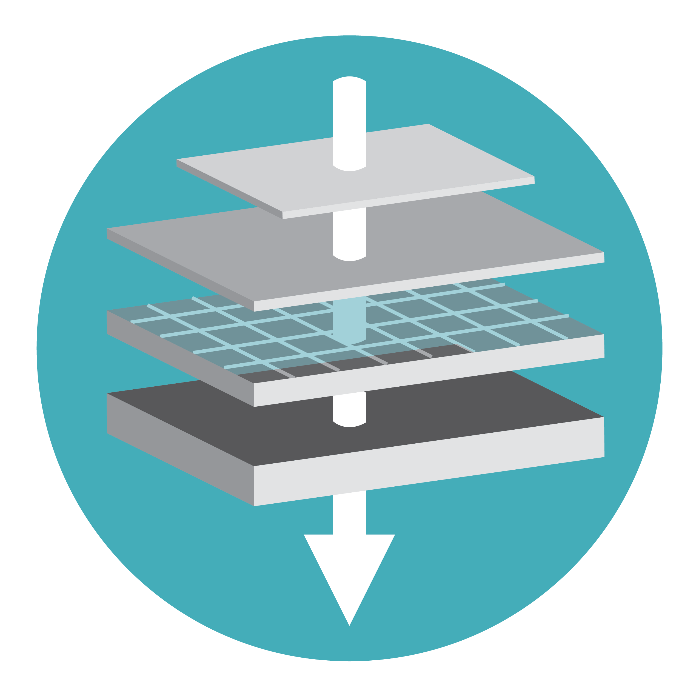

# Make Your Map

This tutorial explains how to create maps from your HFF Survey data using the GIS integration features.

## Overview

HFF Survey integrates with QGIS to create professional maps showing:

- Site locations
- Survey areas
- Artifact distributions
- Thematic maps
- Export-ready layouts

---

## GIS Layer Management

### Loading HFF Layers

1. Click **HFF Menu > GIS Tools > Load Layers**
2. Or click the **GIS** icon  in the toolbar
3. Select layers to load:
   - Sites
   - Divelogs
   - Anchors
   - Shipwrecks
   - Artefacts
   - Pottery

### Layer Structure

| Layer | Geometry | Description |
|-------|----------|-------------|
| hff_sites | Point/Polygon | Archaeological sites |
| hff_divelog | Point | Dive locations |
| hff_anchor | Point | Anchor finds |
| hff_shipwreck | Point/Polygon | Shipwreck sites |
| hff_artefact | Point | Individual finds |
| hff_pottery | Point | Pottery locations |

---

## Creating a Basic Map

### Step 1: Load Your Data

1. Open your HFF database
2. Click **Load Layers**
3. Select layers to display
4. Layers appear in QGIS

### Step 2: Set Base Map

Add a background map:

1. **Web > QuickMapServices > OSM > Standard**
2. Or add satellite imagery
3. Arrange layer order (data on top)

### Step 3: Style Your Layers

1. Right-click layer > **Properties**
2. Go to **Symbology** tab
3. Choose style:
   - **Single Symbol**: Same style for all
   - **Categorized**: By attribute (e.g., site type)
   - **Graduated**: By numeric value

### Step 4: Add Labels

1. Layer Properties > **Labels**
2. Select **Single Labels**
3. Choose label field
4. Adjust font, size, placement

---

## Thematic Maps

### Site Type Map

Create a map showing different site types:

1. Load Sites layer
2. Open Properties > Symbology
3. Select **Categorized**
4. Column: `definition`
5. Click **Classify**
6. Adjust colors for each type

### Chronological Map

Show sites by time period:

1. Load Sites layer
2. Symbology > **Categorized**
3. Column: `dating`
4. Assign colors to periods
5. Apply

### Condition Map

Display site conditions:

1. Load Sites layer
2. Symbology > **Graduated**
3. Column: `condition_state`
4. Choose color ramp (green to red)
5. Apply

---

## Distribution Maps

### Point Density

Show artifact concentrations:

1. Load Artefact layer
2. Symbology > **Heatmap**
3. Adjust:
   - Radius
   - Color ramp
   - Maximum value

### Cluster Map

Group nearby points:

1. Symbology > **Point Cluster**
2. Set distance threshold
3. Define cluster symbol

---

## Map Layouts

### Creating a Print Layout

1. **Project > New Print Layout**
2. Name your layout
3. Add map elements:
   - Map frame
   - Title
   - Legend
   - Scale bar
   - North arrow
   - Credits

### Adding Map Frame

1. Click **Add Map** tool
2. Draw rectangle on layout
3. Map displays at current view
4. Lock layers/extent if needed

### Essential Elements

| Element | Purpose |
|---------|---------|
| **Title** | Map name and date |
| **Legend** | Symbol explanation |
| **Scale Bar** | Distance reference |
| **North Arrow** | Orientation |
| **Grid** | Coordinate reference |
| **Source** | Data attribution |

---

## Exporting Maps

### Export as Image

1. Layout > **Export as Image**
2. Choose format (PNG, JPEG, TIFF)
3. Set resolution (300 DPI for print)
4. Click **Save**

### Export as PDF

1. Layout > **Export as PDF**
2. Set options:
   - Resolution
   - Text handling
   - Layer export
3. Click **Save**

### Export as SVG

For vector editing:

1. Layout > **Export as SVG**
2. Editable in Illustrator/Inkscape

---

## Quick Map Tools

### From HFF Forms

Create maps directly from forms:

1. Open any HFF form
2. Click **Show on Map** button
3. Current record highlighted
4. Or click **Map All Records**

### Zoom to Selection

1. Select records in form
2. Click **Zoom to Selection**
3. Map centers on selected features

---

## Styling Tips

### Archaeological Conventions

| Feature | Suggested Style |
|---------|-----------------|
| Sites | Red circles/triangles |
| Finds | Colored dots by type |
| Survey area | Hatched polygon |
| Uncertain | Dashed outline |

### Color Schemes

For periods:

| Period | Color |
|--------|-------|
| Prehistoric | Brown |
| Bronze Age | Orange |
| Iron Age | Red |
| Classical | Blue |
| Medieval | Green |
| Modern | Gray |

---

## Advanced Features

### Atlas Generation

Create multiple maps automatically:

1. Create layout with map
2. Enable **Atlas** panel
3. Set coverage layer (e.g., sites)
4. Each feature = one page
5. Export all at once

### Temporal Maps

Show change over time:

1. Install TimeManager plugin
2. Set time field
3. Animate through dates
4. Export frames or video

---

## Troubleshooting

### Layers Not Showing

- Check layer visibility
- Verify coordinate system
- Check data exists in bounds

### Poor Quality Export

- Increase DPI setting
- Use vector formats (SVG, PDF)
- Check font embedding

### Slow Performance

- Simplify geometries
- Use spatial index
- Reduce visible features

---

*Next: [Excel Export](17_download_excel.md)*
